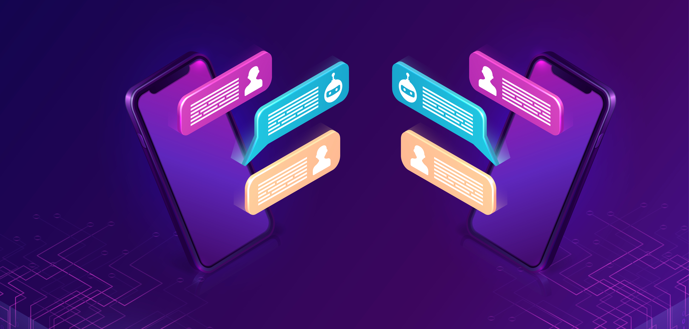
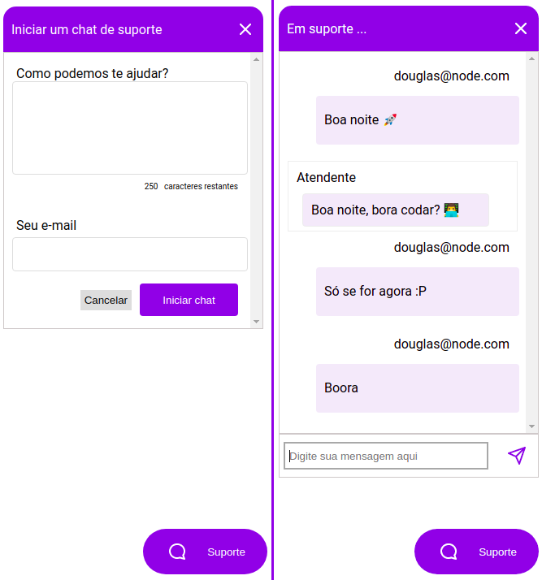
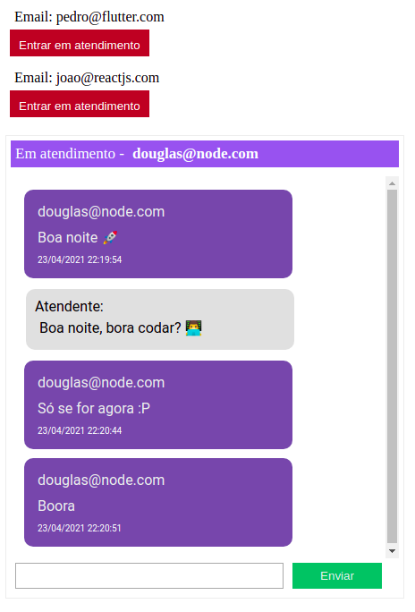

<h1 align="center" >Chat with NodeJS 📲💬</h1>



<br/>

<p align="center">
    <a href="#-projeto">Projeto</a>&nbsp;&nbsp;&nbsp;|&nbsp;&nbsp;&nbsp;
    <a href="#-tecnologias">Tecnologias</a>&nbsp;&nbsp;&nbsp;|&nbsp;&nbsp;&nbsp;
    <a href="#-material-de-apoio">Material de apoio</a>&nbsp;&nbsp;&nbsp;|&nbsp;&nbsp;&nbsp;
    <a href="#-apresentação-visual">Apresentação visual</a>&nbsp;&nbsp;&nbsp;|&nbsp;&nbsp;&nbsp;
    <a href="#-como-baixar">Como baixar</a>&nbsp;&nbsp;&nbsp;|&nbsp;&nbsp;&nbsp;
    <a href="#-banco-de-dados">Banco de dados</a>&nbsp;&nbsp;&nbsp;|&nbsp;&nbsp;&nbsp;
    <a href="#-sobre"> Sobre </a>&nbsp;&nbsp;&nbsp;|&nbsp;&nbsp;&nbsp;
    <a href="#-melhorias">Melhorias</a>

---

## 💬 Projeto

<p align="justify">
    O projeto foi idealizado na trilha de NodeJS da na 5ª edição do NextLevelWeek da Rocketseat. O NLW é um evento online com muito código, desafios, networking e um único objetivo: te levar para o próximo nível.
</p>

---

## 📌 Tecnologias

<p align="justify">
Abaixo estão algumas das tecnologias utilizadas durante o desenvolvimento do projeto. Ainda foi visado: Organizar o diretório da nossa aplicação de forma concisa, limpa e eficiente. Escrever código limpo visando reutilização e eficiência.
</p>
<br>
<p align="center">
  
  
    
  
  
  
  
  
  
  
  
  
</p>

---

## 🗂 Material de apoio

- [Typescript](https://www.typescriptlang.org/)
- [WebSocket](https://www.devmedia.com.br/como-criar-um-chat-com-node-js/33719)
- [TypeORM](https://typeorm.io/#/)
- [Express](https://expressjs.com/pt-br/)

---

## 📊 Apresentação visual:

Bom, o _frontend_ foi concebido de maneira bem simples apresentadando duas visões:

### 🖥️ Tela de Cliente:

Na imagem da esquerda é apresentado o botão de "Suporte", onde clicando apresenta o texto inicial a ser inserido e um e-mail. Assim é iniciado a conversa com um atendente.

Já na imagem da direita é apresentado uma conversa já em andamento.


<p align="center" >
    
</p>

### 🖥️ Tela de Atendente:

Nela é apresentado uma "fila" de atendimentos pendentes, onde de maneira automática somente pode existir 1 (um) atendente por _chat_. E abaixo dos atendimentos pendentes, é apresentado os _chat's_/atendimentos acontecendo em tempo real.

<p align="center" >
    
</p>

---

## ⬇️ Como baixar

```bash
    // Clonar repositório
    $ git clone https://github.com/douglasconstancio/chat-nodejs.git

    // Acessar diretório
    $ cd chat-nodejs

    // Instalar dependências
    $ yarn

    // Realizar as migrações
    $ yarn migration:run

    // Iniciar projeto
    $ yarn dev
```
---

## 🏦🎲 Banco de dados

Foi escolhido o SQLite como banco de dados para facilitar o desenvolvimento sendo um banco prático de manipulação.

---

## 💭 Melhorias

- Se dedicar mais ao _frontend_ segmentando algumas funções;
- Tornar o _frontend_ responsivo;
- Melhorar usabilidade;
- Adicionar algumas funcionalidades no chat;
- Adicionar testes automatizados;

---

## 🚀 Sobre

<p align="justify">
Este projeto foi idealizado na trilha de NodeJS da na 5ª edição do NextLevelWeek da Rocketseat. O NLW é um evento online com muito código, desafios, networking e aprendizado.
</p>

---
